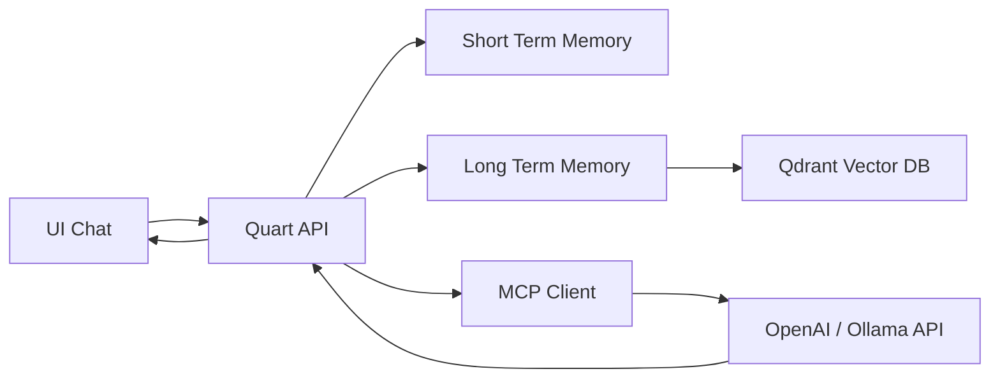
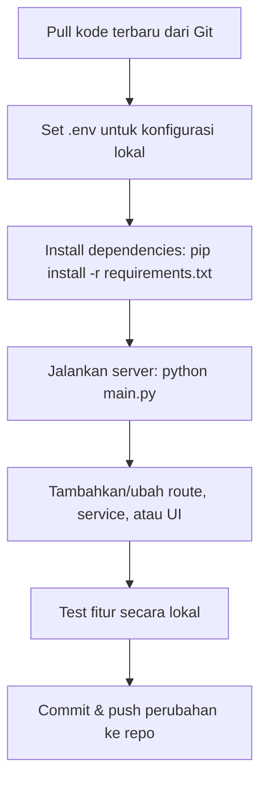

# ProjectWise Quart — Async AI Chatbot Platform

ProjectWise Quart adalah **asynchronous web application** berbasis [Quart](https://pgjones.gitlab.io/quart/) yang mengintegrasikan:

- Chatbot AI dengan kemampuan **Retrieval-Augmented Generation (RAG)**.
- **Short-Term & Long-Term Memory** untuk konteks percakapan.
- **MCP Client** untuk akses LLM & tools eksternal.
- Integrasi knowledge base dari file (KAK, TOR, produk, dll.).

Dirancang untuk membantu **presales** dan **project management assistant** dengan performa tinggi dan arsitektur modular.

---

## ✨ Fitur Utama

- **Full Async**: Memanfaatkan async/await untuk semua route & service.
- **Multi-Interface**:
  - REST API untuk chat (`/chat_mem`)
  - WebSocket multi-room dengan streaming token (`/ws/chat/<room_id>/<user_id>`)
- **Memory Management**:
  - Short-Term Memory (SQLite async via SQLAlchemy + `aiosqlite`)
  - Long-Term Memory (Mem0 + Qdrant)
- **File Ingestion**:
  - Upload & proses file KAK/TOR dan knowledge produk untuk RAG.
- **MCP Integration**:
  - Reconnect, shutdown, dan monitoring status MCP Client.
- **Logging**:
  - Console + file rotasi harian dengan format dan retensi configurable.
- **Konfigurasi via `.env`** untuk semua parameter penting.

---

## 📂 Struktur Proyek

```

projectwise\_quart/
│
├── main.py                  # Entry point server
├── .env                     # Environment configuration
├── requirements.txt
│
├── projectwise/              # Core package
│   ├── **init**.py           # create\_app() & blueprint registration
│   ├── config.py             # BaseConfig & ServiceConfigs
│   ├── extensions.py         # Init MCP, STM, LTM
│   ├── logger.py             # Logger hybrid
│   │
│   ├── routes/               # Endpoint modules
│   │   ├── main.py           # Main UI
│   │   ├── chat.py           # REST chat endpoints
│   │   ├── chat\_ws\_room.py   # WebSocket streaming chat
│   │   └── mcp\_control.py    # MCP control endpoints
│   │
│   ├── services/             # Core services
│   │   ├── mcp/              # MCP Client
│   │   └── memory/           # STM & LTM implementation
│   │
│   ├── templates/            # Jinja2 HTML templates
│   └── static/               # CSS, JS, images
│
└── database/                 # SQLite data
└── chat\_memory.sqlite

````

---

## ⚙️ Instalasi

### 1. Clone Repository
```bash
git clone https://github.com/username/projectwise_quart.git
cd projectwise_quart
````

### 2. Buat Virtual Environment

```bash
python -m venv .venv
source .venv/bin/activate   # Linux/Mac
.venv\Scripts\activate      # Windows
```

### 3. Install Dependencies

```bash
pip install -r requirements.txt
```

### 4. Konfigurasi `.env`

```env
APP_ENV=development
SECRET_KEY=supersecret

# Logging
LOG_LEVEL=INFO
LOG_FORMAT=[%(asctime)s] %(levelname)s in %(module)s: %(message)s
LOG_RETENTION=90

# MCP & LLM
MCP_SERVER_URL=http://localhost:5000/projectwise/mcp/
OPENAI_API_KEY=sk-xxxx
LLM_MODEL=gpt-4o-mini
EMBED_MODEL=text-embedding-3-small

# Qdrant
QDRANT_HOST=localhost
QDRANT_PORT=6333
```

> Pastikan folder `database/` sudah tersedia di root.

---

## ▶️ Menjalankan Server

```bash
python main.py
```

Aplikasi berjalan di:

```
http://0.0.0.0:8000
```

---

## 📡 Endpoint Utama

| Endpoint             | Method | Deskripsi                   |
| -------------------- | ------ | --------------------------- |
| `/main`              | GET    | UI utama                    |
| `/chat_message`      | POST   | Kirim pesan (dummy echo)    |
| `/chat_mem`          | POST   | Chat AI + integrasi STM/LTM |
| `/history/<user_id>` | GET    | Ambil history STM           |
| `/mcp/status`        | GET    | Status MCP Client           |
| `/mcp/reconnect`     | POST   | Reconnect MCP               |
| `/mcp/shutdown`      | POST   | Shutdown MCP                |

---

## 🔌 WebSocket Chat

* **Endpoint**:

  ```
  /ws/chat/<room_id>/<user_id>
  ```
* **Pesan dikirim**:

  ```json
  {"message": "Halo AI"}
  ```
* **Streaming Response**:

  * `type: "delta"` — Token per token
  * `type: "completed"` — Selesai
  * `type: "error"` — Error

---

## 🧠 Arsitektur Memory

* **STM**: Simpan percakapan terbaru per user (SQLite async).
* **LTM**: Simpan & ambil memori relevan (Mem0 + Qdrant vector search).
* **Integrasi**: Sebelum ke LLM, memori relevan digabung ke prompt.

---

## 🔄 Alur Proses Chat



1. User mengirim pesan.
2. STM menyimpan pesan.
3. LTM mencari memori relevan.
4. Prompt digabung & dikirim ke LLM via MCP.
5. Jawaban disimpan ke STM & LTM.
6. Respons dikirim ke user (REST/WebSocket).

---

## 📌 Catatan Penting

* Gunakan `sqlite+aiosqlite` untuk koneksi DB async.
* MCP Server harus berjalan jika ingin menggunakan tools ingestion/RAG.
* `.env` wajib diatur sebelum menjalankan.

---

## 📜 Lisensi

MIT License © 2025 — ProjectWise Team

---


---

## 🔧 Panduan Pengembangan

Bagian ini membantu developer memahami **bagaimana proyek ini dibangun**, struktur kodenya, dan cara menambah fitur baru.

---

### 1️⃣ Arsitektur Aplikasi

Proyek ini menggunakan pola **Factory App** ala Flask/Quart, tapi semua komponen dibuat **asynchronous**.

**Alur Inisialisasi:**

1. `main.py` → Menjalankan fungsi `create_app()` dari `__init__.py`.
2. `__init__.py`:

   * Memuat konfigurasi dari `config.py` atau `.env`.
   * Memanggil `init_extensions()` di `extensions.py` untuk menginisialisasi:

     * MCP Client (akses LLM)
     * ShortTermMemory (SQLite async)
     * LongTermMemory (Mem0 + Qdrant)
   * Mendaftarkan semua Blueprint di folder `routes/`.
3. Server dijalankan oleh **Hypercorn** untuk full async support.

---

### 2️⃣ Komponen Utama

| Modul              | Fungsi                                                      |
| ------------------ | ----------------------------------------------------------- |
| `config.py`        | Menyimpan konfigurasi dasar aplikasi dan service eksternal. |
| `extensions.py`    | Inisialisasi MCP Client, STM, dan LTM.                      |
| `logger.py`        | Logger hybrid (console + file dengan rotasi harian).        |
| `routes/`          | Blueprint untuk UI, REST API, WebSocket, dan kontrol MCP.   |
| `services/memory/` | Implementasi ShortTermMemory & LongTermMemory.              |
| `services/mcp/`    | MCP Client async untuk komunikasi dengan LLM.               |
| `templates/`       | HTML Jinja2 untuk UI chatbot.                               |
| `static/`          | Asset frontend (CSS, JS).                                   |

---

### 3️⃣ Alur Pengembangan Fitur Baru

#### a. Menambah Endpoint REST

1. Buat file baru di `routes/` atau tambahkan di file blueprint yang sesuai.
2. Gunakan dekorator route `@blueprint.route()` dan async function.
3. Daftarkan blueprint di `__init__.py`.

#### b. Menambah Endpoint WebSocket

1. Tambahkan handler di file seperti `chat_ws_room.py`.
2. Gunakan `@blueprint.websocket()` untuk menerima koneksi WS.
3. Implementasikan loop untuk menerima & mengirim pesan secara streaming.

#### c. Integrasi ke LLM atau Service Baru

1. Tambahkan konfigurasi di `.env` dan `config.py`.
2. Buat instance di `extensions.py`.
3. Simpan ke `app.extensions` agar bisa diakses dari semua route.

---

### 4️⃣ Dependensi Utama

* **Backend**: Quart, SQLAlchemy async, aiosqlite
* **LLM Integration**: MCP Client, OpenAI API, Mem0
* **Vector Database**: Qdrant
* **Frontend**: HTML, CSS, JavaScript (Vanilla)
* **Server**: Hypercorn (ASGI server)

---

### 5️⃣ Best Practices di Proyek Ini

* **Selalu async/await** untuk semua operasi I/O (DB, HTTP, WS).
* **Pisahkan concerns**:

  * Routing di `routes/`
  * Logika service di `services/`
  * Konfigurasi di `config.py`
* Gunakan `current_app.extensions` untuk mengakses service yang sudah diinisialisasi.
* **Gunakan logger bawaan** (`get_logger`) untuk semua log.

---

### 6️⃣ Workflow Developer


