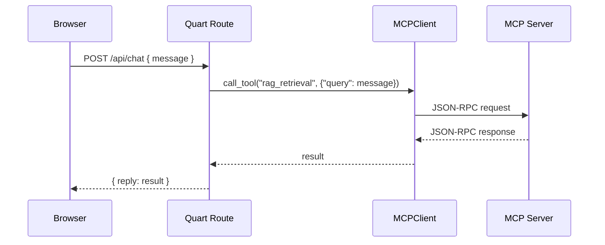

# 🛠 Developer Documentation — MCPClient (Quart Extension)

## 1. Overview

`MCPClient` adalah client asynchronous untuk berkomunikasi dengan **MCP Server** menggunakan protokol JSON-RPC berbasis HTTP streaming.  
Di proyek ini, MCPClient dijadikan **extension Quart**, sehingga dapat digunakan di seluruh modul melalui:

```python
current_app.extensions["mcp_client"]
````

**Fitur Utama**

* 🔄 Manajemen koneksi otomatis (connect, reconnect, shutdown)
* ❤️ Heartbeat loop untuk menjaga koneksi tetap hidup
* 📋 Pembaruan daftar tool secara periodik
* 📝 Dukungan *elicitation* (permintaan input tambahan dari user)
* ⚡ Pemanggilan tool dengan *error handling* yang robust

---

## 2. Struktur Proyek Relevan

```
projectwise_quart/
├── projectwise/
│   ├── __init__.py           # create_app & init_extensions
│   ├── extensions.py         # Registrasi MCPClient & service lain
│   ├── services/
│   │   ├── mcp/
│   │   │   └── client.py     # MCPClient class
│   ├── routes/
│   │   └── chat.py           # Contoh route
└── main.py                   # Entry point
```

---

## 3. Setup & Konfigurasi

### `.env` Contoh

```env
MCP_SERVER_URL=http://localhost:5000/projectwise/mcp
OPENAI_API_KEY=sk-xxxx
OLLAMA_HOST=http://localhost:11434
LLM_MODEL=gpt-4o-mini
EMBED_MODEL=text-embedding-3-small
```

### Dependency Utama

* [Quart](https://pgjones.gitlab.io/quart/)
* [AnyIO](https://anyio.readthedocs.io/)
* [OpenAI Python SDK](https://github.com/openai/openai-python)
* [mcp](https://pypi.org/project/mcp/)
* [pydantic-settings](https://docs.pydantic.dev/latest/concepts/pydantic_settings/)
* [jsonschema](https://python-jsonschema.readthedocs.io/en/stable/)

---

## 4. Registrasi MCPClient di Quart

**`projectwise/extensions.py`**

```python
from .services.mcp.client import MCPClient
from .config import ServiceConfigs

async def init_extensions(app):
    settings = ServiceConfigs()
    app.extensions["service_configs"] = settings

    # Inisialisasi MCPClient
    mcp_client = MCPClient(server_url=settings.mcp_server_url)
    await mcp_client.connect()

    app.extensions["mcp_client"] = mcp_client
```

**`projectwise/__init__.py`**

```python
from quart import Quart
from .extensions import init_extensions

async def create_app():
    app = Quart(__name__)
    await init_extensions(app)
    return app
```

---

## 5. Penggunaan di Routes & Services

### Contoh di Route

```python
from quart import Blueprint, request, jsonify, current_app

bp = Blueprint("chat", __name__)

@bp.route("/api/chat", methods=["POST"])
async def chat():
    data = await request.get_json()
    mcp_client = current_app.extensions["mcp_client"]

    result = await mcp_client.call_tool(
        "rag_retrieval",
        {"query": data.get("message", "")}
    )
    return jsonify({"reply": result})
```

### Contoh di Service

```python
from quart import current_app

async def ask_bot(message: str):
    mcp_client = current_app.extensions["mcp_client"]
    return await mcp_client.call_tool("rag_retrieval", {"query": message})
```

---

## 6. Alur Kerja MCPClient

1. **Inisialisasi**

   * `connect()` membuka koneksi streaming ke MCP server.
   * Memuat daftar tool awal (`list_tools`) ke cache.

2. **Heartbeat**

   * Mengirim tool `heartbeat` setiap 30 detik untuk menjaga koneksi aktif.

3. **Pemanggilan Tool**

   * `call_tool(name, args)` mengirim JSON-RPC ke server.
   * Auto reconnect jika koneksi terputus.

4. **Pembaruan Tool Cache**

   * Memperbarui daftar tool setiap 60 detik di background.

5. **Elicitation**

   * Menangani permintaan input tambahan dari MCP server.
   * Memvalidasi input user menggunakan JSON Schema.

6. **Shutdown**

   * Membatalkan task background dan menutup koneksi dengan aman.

---

## 7. Sequence Diagram



---

## 8. schema
* mcp tool schema: `tool_list()`

```json
{
    'type': 'function', 
    'name': 'ingest_product_knowledge', 
    'description': "Use this tool to ingest a product PDF into vector database for product knowledge base only if user explisit ask for it. Requires: category, product_name, year, filename. Example: category='Internet Services', product_name='Internet_Dedicated', tahun='2025', filename='Internet_Dedicated.pdf'. ",
    'parameters': {
        'properties': {
            'category': {
                'title': 'Category', 
                'type': 'string'
            }, 
            'product_name': {
                'title': 'Product Name', 
                'type': 'string'
            }, 
            'tahun': {
                'title': 'Tahun', 
                'type': 'string'
            }, 
            'filename': {
                'title': 'Filename', 
                'type': 'string'
            }, 
            'overwrite': {
                'default': False, 
                'title': 'Overwrite', 
                'type': 'boolean'
            }
        }, 
        'required': ['category', 'product_name', 'tahun', 'filename'], 
        'title': 'ingest_product_knowledge_toolArguments', 
        'type': 'object'
    }
}
```

---

## 9. Best Practices

* Gunakan `async with MCPClient()` untuk script standalone.
* Selalu gunakan `await` di semua pemanggilan MCPClient.
* Tangani exception:

```python
try:
    result = await mcp_client.call_tool("heartbeat", {})
except Exception as e:
    logger.error(f"MCP error: {e}")
```

* Jangan memanggil MCPClient sebelum `create_app()` selesai.
* Gunakan `await mcp_client.list_tools()` untuk memeriksa daftar tool yang tersedia.
* Pastikan `.env` sudah berisi konfigurasi yang benar sebelum menjalankan aplikasi.
