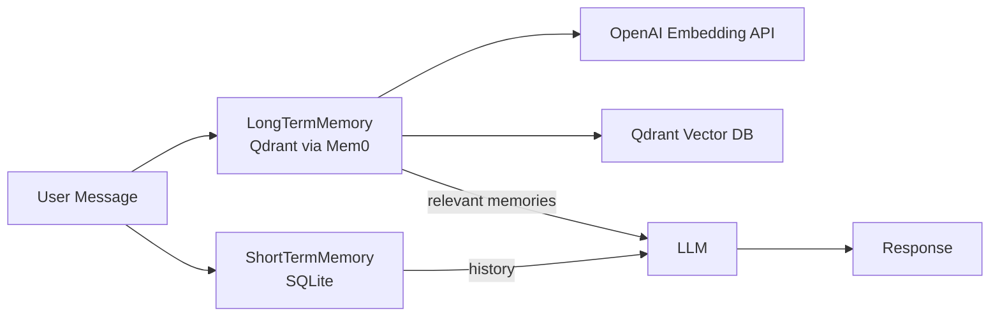

# 🧠 ProjectWise Memory System — ShortTerm & LongTerm Memory

Sistem memory di ProjectWise bertugas menyimpan dan mengelola **konteks percakapan** untuk AI Agent, terdiri dari:
- **ShortTermMemory (STM)** — menyimpan percakapan jangka pendek di database lokal (SQLite).
- **LongTermMemory (LTM)** — menyimpan percakapan jangka panjang di **vector database** (Qdrant) untuk **context retrieval** dengan **embedding**.

Dengan integrasi ini, AI Agent dapat mengingat percakapan sebelumnya dan memberikan jawaban yang lebih relevan.

---

## 🛠 1. Tech Stack

| Komponen               | Teknologi Digunakan                                                                 |
|------------------------|-------------------------------------------------------------------------------------|
| **Database STM**       | SQLite async + SQLAlchemy ORM (`aiosqlite`)                                         |
| **Database LTM**       | [Qdrant](https://qdrant.tech/)                                                       |
| **Vector Store Client**| [Mem0](https://github.com/mem0ai/mem0)                                               |
| **Embedding Model**    | OpenAI Embedding API (`text-embedding-3-small` / sesuai `.env`)                     |
| **LLM Provider**       | OpenAI API / Ollama (via MCP Client)                                                 |
| **Framework**          | [Quart](https://pgjones.gitlab.io/quart/)                                           |
| **Config Loader**      | pydantic-settings + `.env`                                                           |
| **Logging**            | Python `logging` + `TimedRotatingFileHandler`                                       |

---

## ✨ 2. Fitur

### ShortTermMemory (STM)
- Menyimpan percakapan terbaru hingga `max_history` pesan.
- Dikelola dengan **SQLite async** menggunakan SQLAlchemy.
- Mendukung multiple user/session.
- Query cepat untuk history percakapan.

### LongTermMemory (LTM)
- Menyimpan percakapan ke **vector database** (Qdrant) untuk pencarian memori relevan.
- Menggunakan Mem0 AsyncMemory untuk interface sederhana.
- Pencarian berbasis **semantic similarity** menggunakan embedding.
- Mendukung **Retrieval-Augmented Generation (RAG)** untuk integrasi dengan LLM.

---

## 🚀 3. Cara Penggunaan di Quart & Integrasi LLM AI Agent

### a. Inisialisasi di `extensions.py`
```python
# ShortTermMemory
db_url = app.config["SQLALCHEMY_DATABASE_URI"]
short_term_memory = ShortTermMemory(db_url=db_url, echo=False, max_history=20)
await short_term_memory.init_models()
app.extensions["short_term_memory"] = short_term_memory

# LongTermMemory
long_term_memory = Mem0Manager(service_configs)
await long_term_memory.init()
app.extensions["long_term_memory"] = long_term_memory
````

### b. Menyimpan & Mengambil dari STM

```python
stm = current_app.extensions["short_term_memory"]

# Simpan pesan
await stm.save(user_id="u123", role="user", content="Halo, apa kabar?")

# Ambil history
history = await stm.get_history("u123", limit=5)
```

### c. Menyimpan & Mengambil dari LTM

```python
ltm = current_app.extensions["long_term_memory"]

# Tambah percakapan
await ltm.add_conversation([
    {"role": "user", "content": "Apa itu RAG?"},
    {"role": "assistant", "content": "RAG adalah ..."}
], user_id="u123")

# Cari memori relevan
relevant = await ltm.get_memories("Jelaskan RAG", user_id="u123")
```

### d. Integrasi dengan LLM

```python
mcp_client = current_app.extensions["mcp"]
ltm = current_app.extensions["long_term_memory"]

# Ambil memori relevan & buat prompt
memories = await ltm.get_memories(user_message, user_id=user_id)
system_prompt = f"Memori relevan:\n{'\n'.join(memories)}"

messages = [
    {"role": "system", "content": system_prompt},
    {"role": "user", "content": user_message}
]

response = await mcp_client.responses.create(
    model="gpt-4o-mini",
    input=messages
)
```

---

## 🧠 4. Konsep & Cara Kerja

### ShortTermMemory

* Tujuan: Menyimpan percakapan **terbaru** yang sering digunakan dalam satu sesi.
* Media: SQLite async (lokal).
* Limitasi: `max_history` pesan terakhir per user.

### LongTermMemory

* Tujuan: Menyimpan **seluruh pengetahuan & percakapan penting** untuk bisa diambil kapan saja.
* Media: Qdrant (vector database).
* Mekanisme:

  1. Setiap pesan diubah menjadi embedding (OpenAI API).
  2. Disimpan ke Qdrant via Mem0.
  3. Query akan mencari vector terdekat untuk menemukan memori relevan.

**Diagram Alur Memory**



---

## 🛠 5. Pengembangan Lanjutan

* **Optimasi RAG**: Tambahkan filter berdasarkan metadata (timestamp, topik, user).
* **Multi-modal Memory**: Mendukung penyimpanan gambar, dokumen, atau audio.
* **Hybrid Search**: Kombinasi semantic search (vector) dan keyword search.
* **Auto-Decay Memory**: Menghapus atau memindahkan data lama dari STM ke LTM secara otomatis.
* **Analytics**: Pantau frekuensi penggunaan memori untuk optimasi prompt.

---

## 📜 Lisensi

MIT License © 2025 — ProjectWise Team

---

## 📦 Contoh Payload API — Integrasi Memory (STM & LTM)

Endpoint ini menggabungkan **ShortTermMemory** dan **LongTermMemory** untuk memberikan jawaban AI dengan konteks percakapan sebelumnya.

---

### 1️⃣ Request ke `/chat_mem`
**Method:** `POST`  
**Content-Type:** `application/json`

```json
{
  "user_id": "u123",
  "message": "Apa itu RAG dan bagaimana cara kerjanya?"
}
````

---

### 2️⃣ Proses di Server

1. **Ambil memori relevan dari LTM**:

   ```python
   relevant_memories = await ltm.get_memories("Apa itu RAG ...", user_id="u123")
   ```
2. **Bangun prompt untuk LLM**:

   ```python
   system_prompt = f"Memori relevan:\n{'\n'.join(relevant_memories)}"
   ```
3. **Panggil LLM via MCP Client**.
4. **Simpan ke STM & LTM**:

   * STM: Menyimpan percakapan terbaru (untuk konteks singkat).
   * LTM: Menyimpan percakapan sebagai pengetahuan jangka panjang.

---

### 3️⃣ Response dari Server

```json
{
  "user_id": "u123",
  "user_message": "Apa itu RAG dan bagaimana cara kerjanya?",
  "assistant_reply": "RAG (Retrieval-Augmented Generation) adalah teknik ...",
  "relevant_memories": [
    "RAG adalah teknik yang menggabungkan pencarian informasi dan generasi teks",
    "Memanfaatkan vector search untuk menemukan dokumen relevan"
  ]
}
```

---

### 4️⃣ Catatan

* `relevant_memories` dihasilkan dari **LongTermMemory** menggunakan pencarian semantik.
* `assistant_reply` dihasilkan oleh LLM dengan tambahan konteks dari memori.
* Setiap percakapan akan otomatis disimpan ke:

  * **STM** untuk riwayat singkat.
  * **LTM** untuk pengetahuan jangka panjang.
